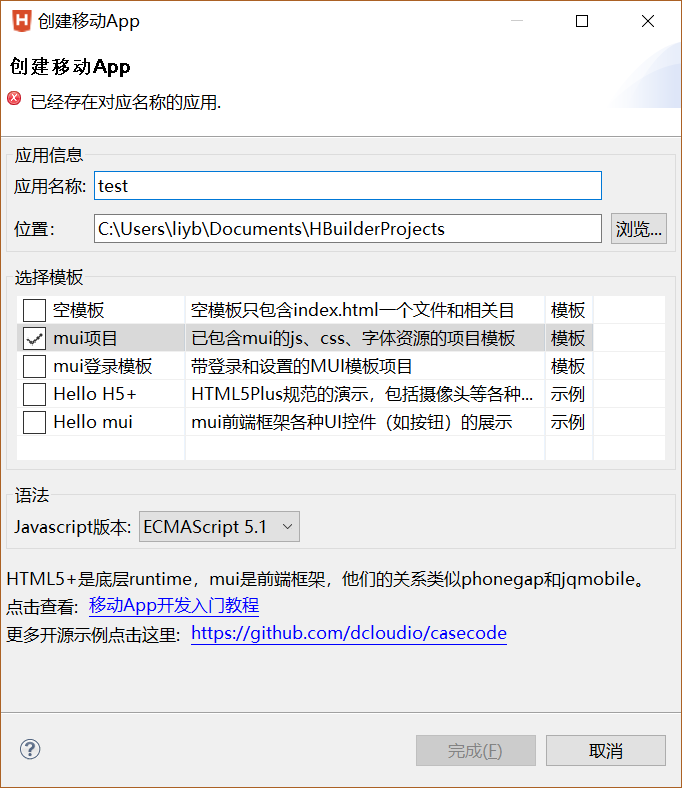
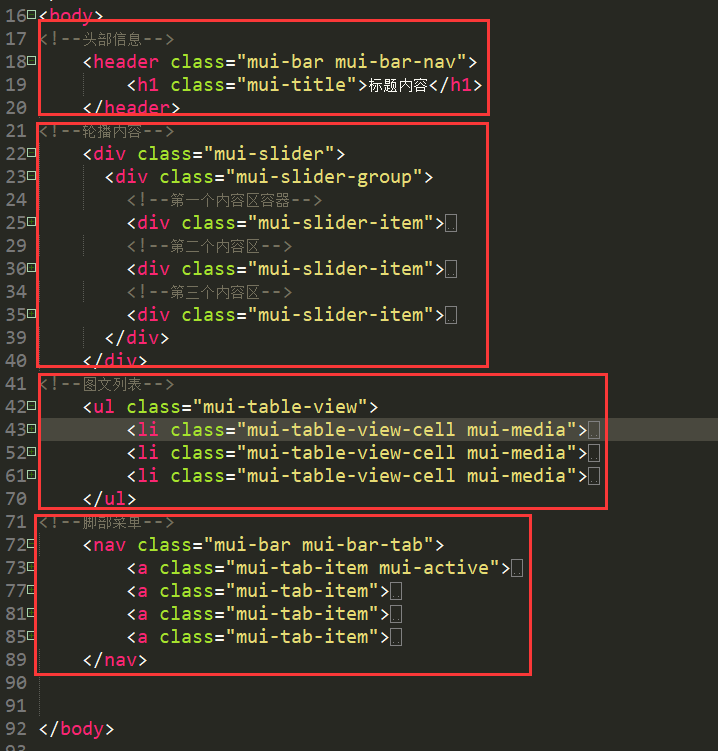
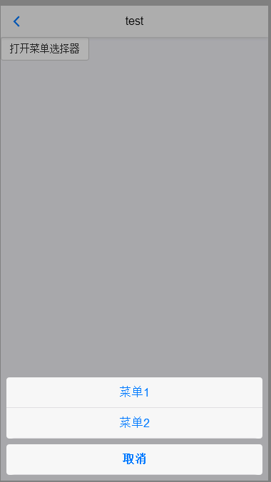
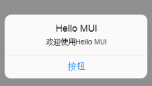
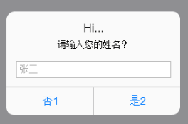

# MUI   

M：MUI是什么东西？

Z：一款专门为手机Web端设计的UI框架。

#### 新建项目

M：怎么新建项目呢？

Z：在HBuilder下，右键--新建移动APP，选择MUI模板即可新建一个包含有js，css等mui资源的完整项目。

    

Z：这是基本的mui结构，由头部和内容部分构成

```html
<!DOCTYPE html>
<html>
<head>
    <meta charset="utf-8">
    <meta name="viewport" content="width=device-width,initial-scale=1,minimum-scale=1,maximum-scale=1,user-scalable=no" />
    <title></title>
    <script src="js/mui.min.js"></script>
    <link href="css/mui.min.css" rel="stylesheet"/>
    <script type="text/javascript" charset="utf-8">
      	mui.init();
    </script>
</head>
<body>
	<!--头部框s -->
	<header class="mui-bar mui-bar-nav">
		<a class="mui-action-back mui-icon mui-icon-left-nav mui-pull-left"></a>
		<h1 class="mui-title">test</h1>
	</header>
	<!--头部框e -->
	<!--内容框s -->
	<div class="mui-content">

	</div>
	<!--内容框e -->
</body>
</html>
```

M：MUI组件的位置大概是怎么放置呢？

Z：最外层``<body>``标签，里面包含不同的mui组件，一般第一个为header

 

#### 折叠面板

M：怎么实现折叠面板呢？

Z：使用代码

```html
	<!--内容框s -->
	<div class="mui-content">
		<!--折叠面板s-->
		<ul class="mui-table-view">
			<li class="mui-table-view-cell mui-collapse">
				<a class="mui-navigate-right" href="#">面板</a>
				<div class="mui-collapse-content">
					<p>面板1内容</p>
					
				</div>
			</li>
			<li class="mui-table-view-cell mui-collapse">
				<a class="mui-navigate-right" href="#">面板2</a>
				<div class="mui-collapse-content">
					<p>面板2内容</p>
					
				</div>
			</li>
			
		</ul>
		<!--折叠面板e-->
	</div>
	<!--内容框e -->
```

M：那怎么让面板默认打开呢？

Z：添加``.mui-active``即可

```html
<li class="mui-table-view-cell mui-collapse">
```

  

#### 常用按钮

M：mui的常用按钮有哪些呢？

Z：如下颜色的按钮，也可以自定义css修改样式

```html
	<!--内容框s -->
	<div class="mui-content">
		<!--按钮s-->
		<button type="button" class="mui-btn">默认</button>
		<button type="button" class="mui-btn mui-btn-primary">蓝色</button>
		<button type="button" class="mui-btn mui-btn-success">绿色</button>
		<button type="button" class="mui-btn mui-btn-warning">黄色</button>
		<button type="button" class="mui-btn mui-btn-danger">红色</button>
		<button type="button" class="mui-btn mui-btn-royal">紫色</button> 
		<!--按钮e-->
	</div>
	<!--内容框e -->
```

  

#### 菜单选择器  

M：我想要做一个操作菜单，怎么实现？

Z：可以使用操作表，需要配合js使用

```html
	<!--内容框s -->
	<div class="mui-content">
		<button type="button" class="mui-btn myBtnRed" onclick="showMenu();">打开菜单选择器</button>
		<!--可选择菜单 s-->
		<div id="sheet1" class="mui-popover mui-popover-bottom mui-popover-action ">
		    <ul class="mui-table-view">
		      <li class="mui-table-view-cell">
		        <a href="#">菜单1</a>
		      </li>
		      <li class="mui-table-view-cell">
		        <a href="#">菜单2</a>
		      </li>
		    </ul>
		    <!-- 取消菜单 -->
		    <ul class="mui-table-view">
		      <li class="mui-table-view-cell">
		        <a href="#sheet1"><b>取消</b></a>
		      </li>
		    </ul>
	    </div>
		<!--可选择菜单 e-->
	</div>
	<!--内容框e -->
	<script type="text/javascript">
		function showMenu(){
			mui('#sheet1').popover('toggle');
		}
	</script>	
```

  

#### 数字脚标   

M：如果我要做新信息提醒，用什么做呢？

Z：可以使用以下代码

```html
<span class="mui-badge">1</span>
<span class="mui-badge mui-badge-primary">12</span>
<span class="mui-badge mui-badge-success">123</span>
<span class="mui-badge mui-badge-warning">3</span>
<span class="mui-badge mui-badge-danger">45</span>
<span class="mui-badge mui-badge-purple">456</span>
```

  

#### 选框  

M：怎么实现单选框呢？

Z：如下代码

```html
		<!--单选框s-->
		<ul class="mui-table-view mui-table-view-radio">
			<li class="mui-table-view-cell">
				<a class="mui-navigate-right">Item 1</a>
			</li>
			<li class="mui-table-view-cell mui-selected">
				<a class="mui-navigate-right">Item 2</a>
			</li>
			<li class="mui-table-view-cell">
				<a class="mui-navigate-right">Item 3</a>
			</li>
		</ul>
		<!--单选框e-->
```

M：复选框呢？

Z：如下代码

```html
		<!--复选框s-->
		<div class="mui-input-row mui-checkbox mui-left">
		  <label>A内容</label>
		  <input name="checkbox1" value="A" type="checkbox" class="chs">
		</div>
		<div class="mui-input-row mui-checkbox mui-left">
		  <label>B内容</label>
		  <input name="checkbox1" value="B" type="checkbox" class="chs">
		</div>
		<!--复选框e-->
```

M：那我要获取复选框的值呢？

Z：使用js代码（但是这段代码目前有bug，checked获取不到票)

```
	function getVals() {
		var res = getChoseVals('chs');
		mui.toast(res);
	}
	<!-- 封装方法 -->	
	function getChoseVals(className){
		var objs = document.getElementsByClassName(className);
		var checkval = new Array();
		var k = 0;
		for(i = 1; 1 < objs.length; i++ ){
			if(objs[i].checked){
				checkval[k] = objs[i].value;
				k++;
			}
		}
		return checkval;
	}
```

#### 日期控件

M：怎么实现日期、时间控件呢？

Z：设置两个按钮，编写点击事件

```html
	<!--内容框s -->
	<div class="mui-content">
	    <div style="padding:15px;">
	        <button id='pickDateBtn' type="button" class="mui-btn">选择日期</button>
	    </div>
	    <div style="padding:15px;">
	        <button id='pickTimeBtn' type="button" class="mui-btn">选择时间</button>
		</div>
	</div>
	<!--内容框e -->
```

点击事件（日期控件仅能在手机端使用）

```javascript
	<script type="text/javascript">
		document.getElementById("pickDateBtn").addEventListener('tap', function() {
			var dDate = new Date();
			//设置当前日期（不设置默认当前日期）
			dDate.setFullYear(2016, 7, 16);
			var minDate = new Date();
			//最小时间
			minDate.setFullYear(2010, 0, 1);
			var maxDate = new Date();
			//最大时间
			maxDate.setFullYear(2016, 11, 31);
			plus.nativeUI.pickDate(function(e) {
				var d = e.date;
				mui.toast('您选择的日期是:' + d.getFullYear() + "-" + (d.getMonth() + 1) + "-" + d.getDate());
			}, function(e) {
				mui.toast("您没有选择日期");
			}, {
				title: '请选择日期',
				date: dDate,
				minDate: minDate,
				maxDate: maxDate
			});
		});
		document.getElementById("pickTimeBtn").addEventListener('tap', function() {
			var dTime = new Date();
			//设置默认时间
			dTime.setHours(6, 0);
			plus.nativeUI.pickTime(function(e) {
				var d = e.date;
				mui.toast("您选择的时间是：" + d.getHours() + ":" + d.getMinutes());
			}, function(e) {
				mui.toast("您没有选择时间");
			}, {
				title: "请选择时间",
				is24Hour: true,
				time: dTime
			});
		});		
	</script>
```

#### 对话框   

M：我想提示用户信息，怎么弹出对话框呢？

Z：使用mui.alert('hi...');

M：那我能对询问框做更多的控制吗？

Z：可以修改标题，按钮的名称，甚至还可以加回调函数

```javascript
		mui.alert('欢迎使用Hello MUI', 'Hello MUI','按钮', function() {
		   mui.toast('你刚关闭了警告框');
		});
```

     

M：这种是提示窗口，那我要怎么做选择窗口呢？

Z：相类似，只不过按钮部分改用数组（也可以不添加使用默认），并且利用回调函数的返回值做是否判断   

```javascript
		mui.confirm('真的要删除吗？', '标题',new Array('否1', '是2'),function(e) {
                if(e.index == 1) {
                    mui.toast('是');
                } else {
                    mui.toast('否');
                }
        	}
     	);
```

  

M：我发现有一种弹出框是可以输入少量内容的，那该怎么实现呢？

Z：它跟选择窗口很相似，不过它的第一个值为内容，第二个值为提示，第三个才是标题

```javascript
	mui.prompt('请输入您的姓名？','张三', 'Hi...',new Array('否1', '是2'), function(e) {
		if(e.index == 1) {
			mui.toast(e.value);
		} else {
			mui.toast('您取消了输入');
		}
	});
```

  

#### 表单  

M：在手机端的表单应该怎么实现呢？

Z：使用form - div:row - label,input 组合

```html
	<!--内容框s -->
	<div class="mui-content">
		<!--表单元素s-->
		<form class="mui-input-group">
		    <div class="mui-input-row">
		        <label>用户名</label>
		    <input type="text" class="mui-input-clear" placeholder="请输入用户名">
		    </div>
		    <div class="mui-input-row">
		        <label>密码</label>
		        <input type="password" class="mui-input-password" placeholder="请输入密码">
		    </div>
		    <div class="mui-button-row">
		        <button type="button" class="mui-btn mui-btn-primary" >确认</button>
		        <button type="button" class="mui-btn mui-btn-danger" >取消</button>
		    </div>
		</form>
		<!--表单元素e-->
	</div>
	<!--内容框e -->
```

  

#### 页面   

M：使用底部选项卡的时候要怎么打开页面呢？

Z：可以用mui提供的监听方式

```javascript
		//监听跳转页面，底部导航需用
		mui.plusReady(function(){
			document.getElementById('tab2').addEventListener('tap',function(){
				mui.openWindow({
					url:'tel.html',
					id:'tel.html',
                    waiting:{
						autoShow:true,
						title:'正在加载...'
					}
				});
			});
		});
```

Z：也可以使用自定义的onclick事件

```javascript
		//onclick跳转页面
		function tel(){
			mui.openWindow({
				url:'tel.html',
				id:'tel.html',
				extras:{name:'小明',age:18}  //传递参数
			});			
		}
```

M：传递参数在新的页面要怎么获取呢？

Z：使用mui提供的方法，还可以将参数插入到标签中

```html
		姓名：<span id="name"></span>
		年龄：<span id="age"></span>
```
```javascript
			mui.plusReady(function(){
				var sData = plus.webview.currentWebview();
				var name = mui("#name");
				name[0].innerHTML = sData.name;
				var age = mui("#age");
				age[0].innerHTML = sData.age;
				
			});
```

M：为什么我的底部选项卡无法跳页面，还有传参也不显示呢？

Z：这是浏览器的原因，打包成app之后就起效了，所以才要求使用真机调试。

M：如果我想让页面跳转更流畅些，有什么解决方法吗？

Z：可以使用预加载，在进入页面时就把要展示的内容加载好

```javascript
		mui.init({
			preloadPages:[{
				url : "tel.html",
				id : "tel.html",
				extras : {name:'小明', age:18}
			}]
		});
```


其他参考资料：

http://www.hcoder.net/tutorials/info_95.html

https://ke.qq.com/course/203400

http://edu.51cto.com/course/11637.html?source=so


