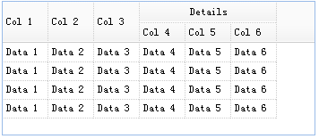

# JqueryUI DataGrid专题(feiman)    

本专题目标是为了构建一个DataGrid，其能够和后台数据交换，实现增删改查的功能。

## 1.基础结构    

### 1.普通类型   

```html
    <table id="tt" class="easyui-datagrid" style="width:400px;height:auto;">
        <thead>
            <tr>
                <th field="name1" width="50">Col 1</th>
                <th field="name2" width="50">Col 2</th>
                <th field="name3" width="50">Col 3</th>
                <th field="name4" width="50">Col 4</th>
                <th field="name5" width="50">Col 5</th>
                <th field="name6" width="50">Col 6</th>
            </tr>                          
        </thead>                           
        <tbody>                            
            <tr>                           
                <td>Data 1</td>            
                <td>Data 2</td>            
                <td>Data 3</td>            
                <td>Data 4</td>            
                <td>Data 5</td>            
                <td>Data 6</td>            
            </tr>
        </tbody>                           
    </table>
```

1. 首先告诉框架，这是一个数据网格``class="easyui-datagrid"``   

2. 为每一列表头设置一个field名称  

   - 在表头中添加``editor="text"``可以指定该列的类型:   

   ``<th field="unitcost" width="80" align="right" editor="numberspinner">Unit Cost</th>``   

     还有其他类型：

   ​	1.多选框： ``editor="{type:'checkbox',options:{on:'P',off:''}}``  (有花括号的为补充属性)     

   ​	2.可变数字：``editor="numberspinner"``  

   ​	3.不可变数字：``editor="{type:'numberbox',options:{precision:1}}``

3. 在tbody里面的列将会以网格行显示    

### 2.跨列表头      

   

（列跨）

```html
    <thead>
        <tr>
            <th field="name1" width="50" rowspan="2">Col 1</th>
            <th field="name2" width="50" rowspan="2">Col 2</th>
            <th field="name3" width="50" rowspan="2">Col 3</th>
            <th colspan="3">Details</th>
        </tr>
        <tr>
            <th field="name4" width="50">Col 4</th>
            <th field="name5" width="50">Col 5</th>
            <th field="name6" width="50">Col 6</th>
        </tr>                          
    </thead>
```

（行跨）

```html
<th rowspan="2" field="status" width="60" align="center">Stauts</th>
```

### 3.添加工具栏   

```html
    </table>
    <div id="tb">
        <a href="#" class="easyui-linkbutton" iconCls="icon-add" plain="true" onclick="javascript:alert('Add')">Add</a>
        <a href="#" class="easyui-linkbutton" iconCls="icon-cut" plain="true" onclick="javascript:alert('Cut')">Cut</a>
        <a href="#" class="easyui-linkbutton" iconCls="icon-save" plain="true" onclick="javascript:alert('Save')">Save</a>
    </div>
```

在a标签中添加``class="easyui-linkbutton"``,该超链接就会变成工具栏按钮   

工具栏单独一个div，跟数据网格table是分离开的    

## 2.数据显示  

### 1.载入数据

```html
<table id="tt" class="easyui-datagrid" style="width:600px;height:250px"
            url="data/datagrid_data.json"
            title="Load Data" iconCls="icon-save">
```

在table中添加url

### 2.添加分页   

```html
    <table id="tt" class="easyui-datagrid" style="width:600px;height:250px"
            url="datagrid24_getdata.php" toolbar="#tb"
            title="Load Data" iconCls="icon-save"
            rownumbers="true" pagination="true">
```

`` rownumbers="true"`` 添加行号，`` pagination="true"``添加分页按钮   


未完待续

